## Anomaly Detection Algorithm

### Results

- Epsilon (threshold for anomaly detection) found using cross validation set: 1.377229e-18
- F1 score evaluation on cross validation set:  0.615385
- Total number of **anomalies** or outliers found using anomaly detection learning algorithm: 117

### Gaussian Distribution or Normal Distribution for Each Feature in the Dataset

To design the anomaly detection learning algorithm for a higher dimensional dataset, multivariate Gaussian distribution or joint normal distribution is computed using mean and variance computed for each of the univariate Gaussian distributions defined for each feature.

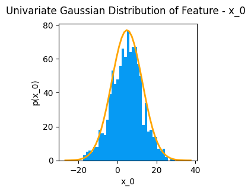

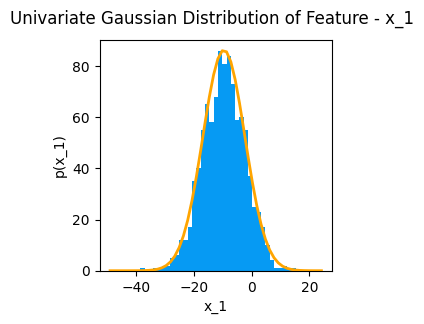

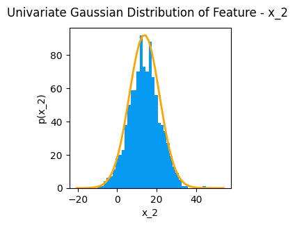

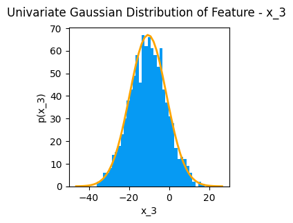

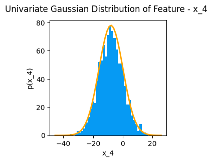

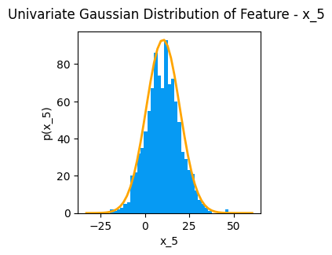

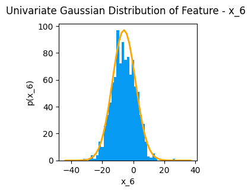

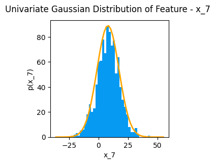

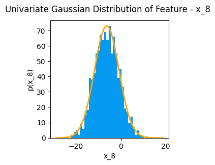

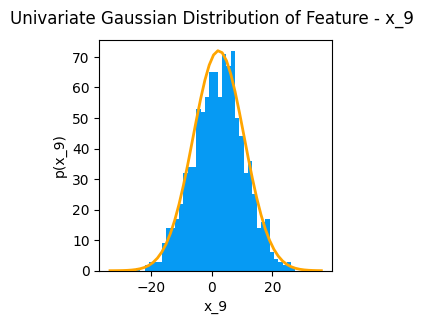

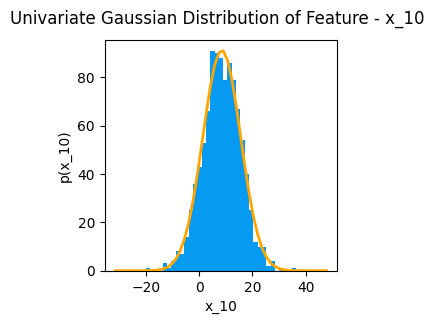
