## Anomaly Detection Algorithm

### Results

- Epsilon (threshold for anomaly detection) found using cross validation set: 1.377229e-18
- F1 score evaluation on cross validation set:  0.615385
- Total number of **anomalies** or outliers found using anomaly detection learning algorithm: 117

### Gaussian Distribution or Normal Distribution for Each Feature in the Dataset

To design the anomaly detection learning algorithm for a higher dimensional dataset, multivariate Gaussian distribution or joint normal distribution is computed using mean and variance computed for each of the univariate Gaussian distributions defined for each feature.

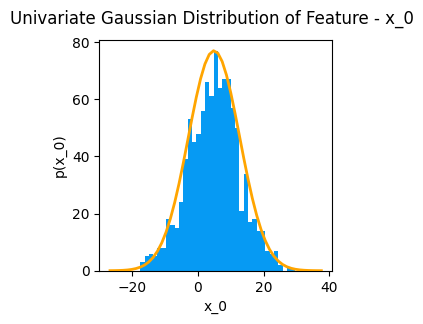

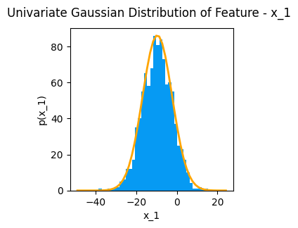

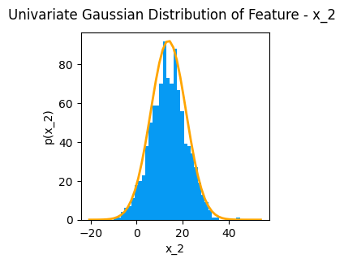

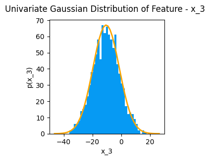

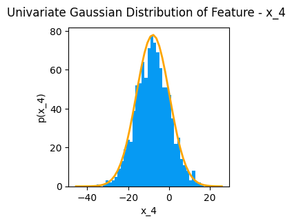

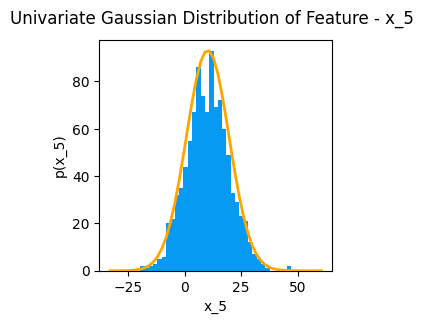

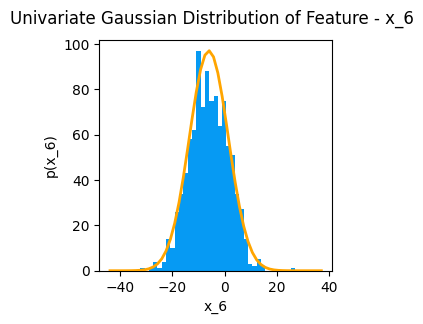

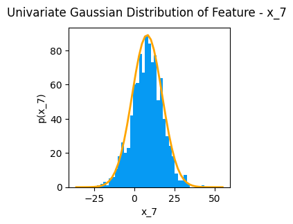

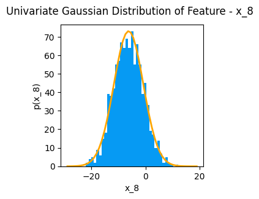

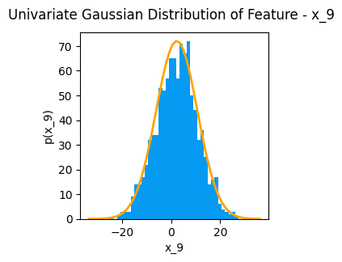

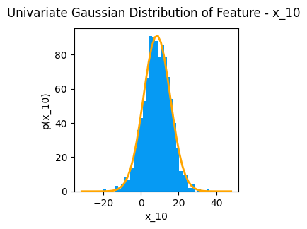

## Citation

Please note that the code and technical details made available are for educational purposes only. The repo is not open for collaboration.

If you happen to use the code from this repo, please use the below citation to cite. Thank you!

balarcode (2026). *GitHub - balarcode/data-science: Practical implementation of selected algorithms, concepts and techniques from data science, data analysis, data characterization and data visualization topics.* GitHub. https://github.com/balarcode/data-science

## Copyright

<a href="https://github.com/balarcode/data-science">Data Science</a> © 2026 by <a href="https://github.com/balarcode">balarcode</a> is licensed under <a href="https://creativecommons.org/licenses/by-nc-nd/4.0/">CC BY-NC-ND 4.0</a>

