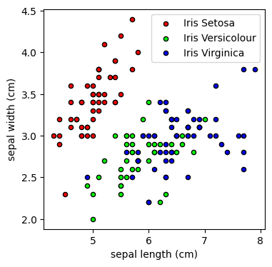
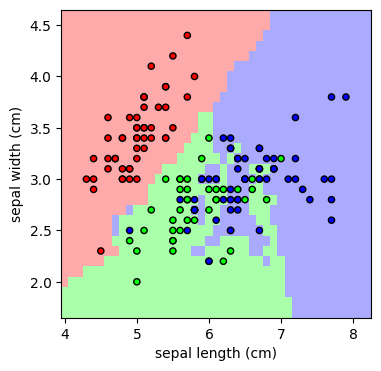

## Classification using K-Nearest Neighbors Algorithm

Note that pairwise distance refers to the distance calculated between all possible pairs of data points in a dataset. In the implementation in k_nearest_neighbors.py, Euclidean distance is chosen as the distance metric. The pairwise distances can be organized into a pairwise distance matrix, where the rows and columns represent the data points in a dataset. The value at the intersection of row 'i' and column 'j' in the matrix represents the distance between datapoint 'i' and datapoint 'j'.

### Training Dataset

### Predicted Labels (Colored Mesh)

## Citation

Please note that the code and technical details made available are for educational purposes only. The repo is not open for collaboration.

If you happen to use the code from this repo, please cite my user name along with link to my profile: https://github.com/balarcode. Thank you!
