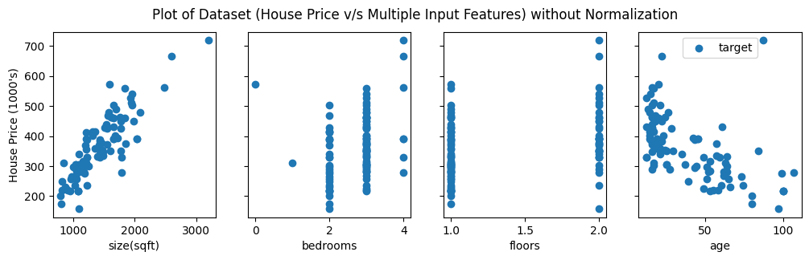
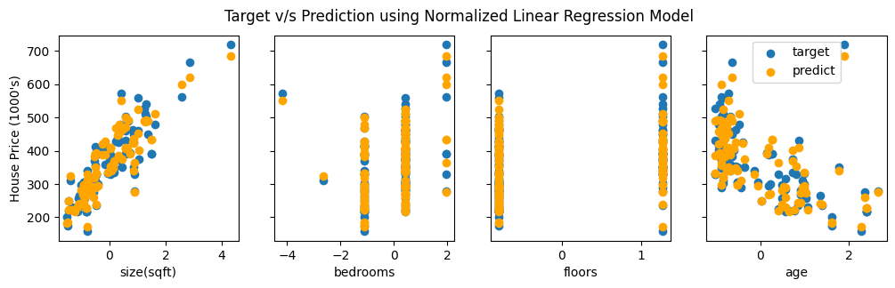
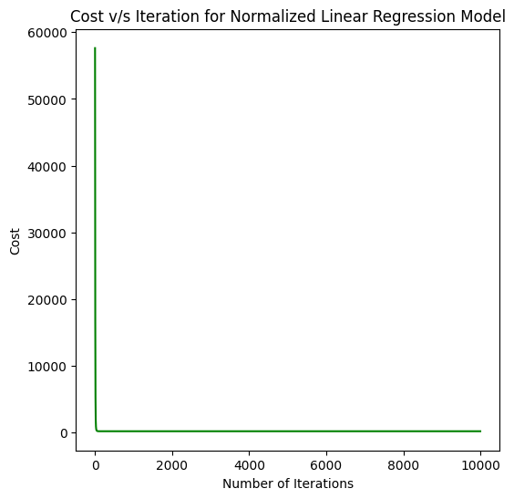
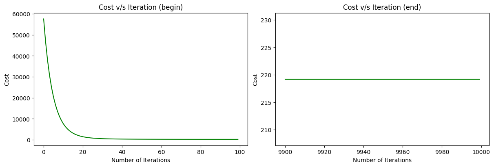

## Linear Regression for Multiple Features (Variables or Dimensions)

### Training Dataset

### Target v/s Prediction using Normalized Linear Regression Model

### Cost v/s Iteration for Normalized Linear Regression Model

## Citation

Please note that the code and technical details made available are for educational purposes only. The repo is not open for collaboration.

If you happen to use the code from this repo, please cite my user name along with link to my profile: https://github.com/balarcode. Thank you!
