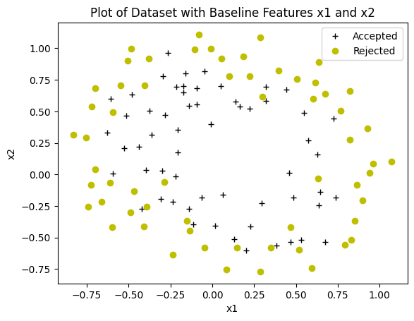

## Regularized Logistic Regression Algorithm For Mapped Features (Higher Dimensions)

### Training Dataset

### Predictions from Regularized Logistic Regression Model

### Cost v/s Iteration for Regularized Logistic Regression Model

### Training Accuracy of Regularized Logistic Regression Algorithm

Training Accuracy: 82.203390

## Citation

Please note that the code and technical details shared are for educational purposes only. The repo is not open for collaboration.

If you happen to use the code from this repo, please cite my user name along with link to my profile: https://github.com/balarcode. Thank you!
