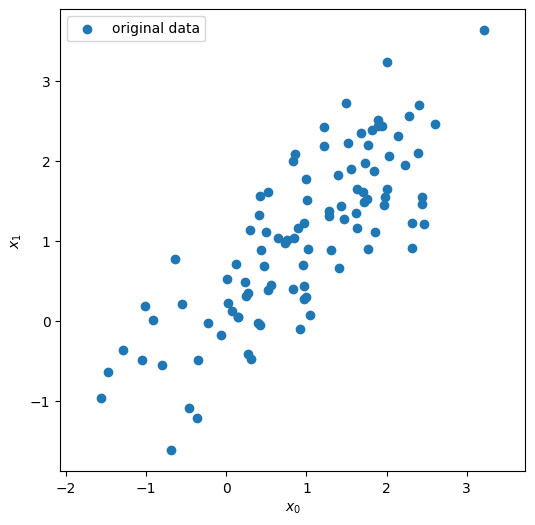
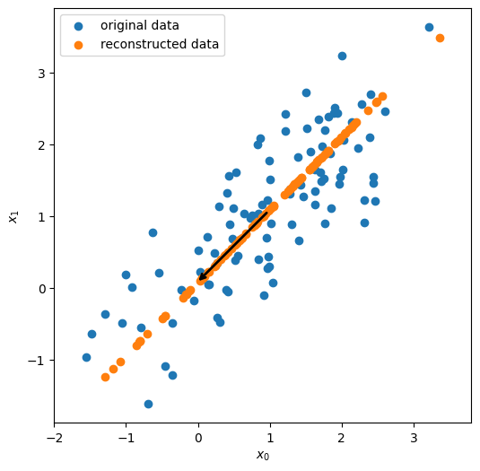

## Dimensionality Reduction using Principal Component Analysis Algorithm

### Input Random Dataset

### Projected Dataset and Principal Component Vector in Principal Subspace

## Citation

Please note that the code and technical details made available are for anyone interested to learn. The repo is not open for collaboration.

If you happen to use the code from this repo, please cite my user name along with link to my profile: https://github.com/balarcode. Thank you!
